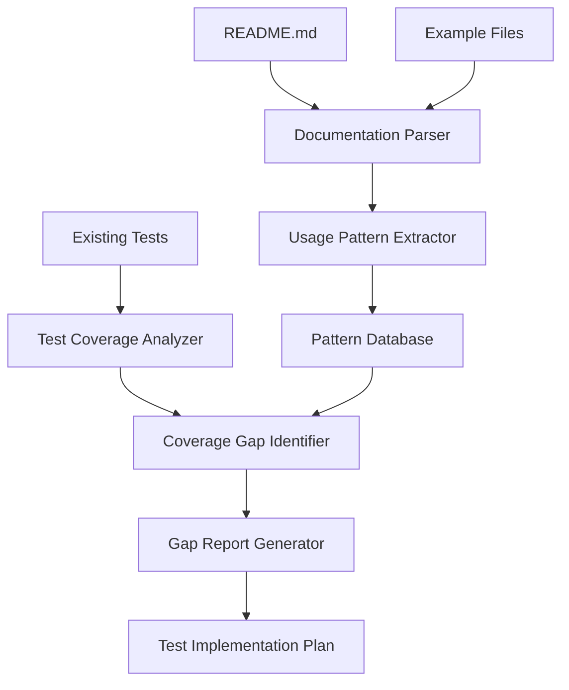
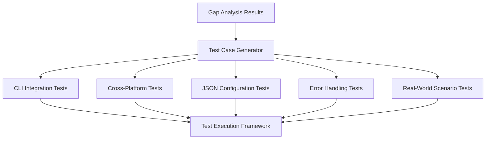

# Test Coverage Analysis Design

## Overview

This design document outlines the approach for analyzing test coverage gaps between documented CLI usage examples and existing tests, then implementing comprehensive test coverage for all documented functionality.

## Architecture

### Analysis Phase Architecture



### Test Implementation Architecture



## Components and Interfaces

### 1. Documentation Analysis Component

**Purpose:** Extract and categorize all CLI usage patterns from documentation

**Key Functions:**

- Parse README.md for CLI examples
- Extract examples from CLI documentation files
- Categorize patterns by type (basic usage, JSON config, error handling, etc.)
- Normalize command variations (long vs short flags)

**Interface:**

```typescript
interface DocumentationAnalyzer {
  extractCliPatterns(filePath: string): CliPattern[];
  categorizePatterns(patterns: CliPattern[]): PatternCategory[];
  normalizeCommands(patterns: CliPattern[]): NormalizedPattern[];
}

interface CliPattern {
  command: string;
  flags: Flag[];
  arguments: string[];
  expectedOutput?: string;
  category: PatternType;
  source: string; // File and line where found
}
```

### 2. Test Coverage Analyzer

**Purpose:** Analyze existing tests to identify coverage gaps

**Key Functions:**

- Parse existing test files
- Extract tested CLI patterns
- Compare with documented patterns
- Identify missing coverage areas

**Interface:**

```typescript
interface TestCoverageAnalyzer {
  analyzeExistingTests(testDir: string): TestPattern[];
  compareWithDocumentation(docPatterns: CliPattern[], testPatterns: TestPattern[]): CoverageGap[];
  generateCoverageReport(gaps: CoverageGap[]): CoverageReport;
}

interface CoverageGap {
  pattern: CliPattern;
  missingAspects: string[];
  priority: 'high' | 'medium' | 'low';
  complexity: 'simple' | 'moderate' | 'complex';
}
```

### 3. Test Case Generator

**Purpose:** Generate comprehensive test cases for identified gaps

**Key Functions:**

- Create test cases for missing patterns
- Generate cross-platform test variations
- Create error scenario tests
- Generate integration test cases

**Interface:**

```typescript
interface TestCaseGenerator {
  generateBasicUsageTests(gaps: CoverageGap[]): TestCase[];
  generateCrossPlatformTests(gaps: CoverageGap[]): TestCase[];
  generateErrorHandlingTests(gaps: CoverageGap[]): TestCase[];
  generateIntegrationTests(gaps: CoverageGap[]): TestCase[];
}
```

## Data Models

### Pattern Classification

```typescript
enum PatternType {
  BASIC_USAGE = 'basic_usage',
  FILE_BASED_SLOTS = 'file_based_slots',
  JSON_CONFIG = 'json_config',
  OUTPUT_OPTIONS = 'output_options',
  ERROR_HANDLING = 'error_handling',
  CROSS_PLATFORM = 'cross_platform',
  INTEGRATION = 'integration',
  ADVANCED_FEATURES = 'advanced_features',
  REAL_WORLD_SCENARIOS = 'real_world_scenarios',
}

interface Flag {
  name: string;
  shortForm?: string;
  value?: string;
  type: 'boolean' | 'string' | 'file_reference';
}
```

### Coverage Analysis Results

```typescript
interface CoverageReport {
  totalPatterns: number;
  coveredPatterns: number;
  coveragePercentage: number;
  gapsByCategory: Record<PatternType, CoverageGap[]>;
  prioritizedGaps: CoverageGap[];
  recommendations: string[];
}
```

## Error Handling

### Documentation Parsing Errors

- Handle malformed markdown
- Skip invalid CLI examples
- Log parsing warnings for manual review

### Test Generation Errors

- Validate generated test syntax
- Handle file system errors during test creation
- Provide fallback test patterns for complex scenarios

### Cross-Platform Considerations

- Generate platform-specific test variations
- Handle path separator differences
- Account for shell-specific behaviors

## Testing Strategy

### Unit Testing

- Test documentation parser with various markdown formats
- Test pattern extraction accuracy
- Test coverage gap identification logic

### Integration Testing

- Test complete analysis workflow
- Validate generated test cases execute correctly
- Test cross-platform compatibility

### Validation Testing

- Verify all documented examples actually work
- Test error scenarios produce expected results
- Validate performance characteristics match documentation

## Implementation Phases

### Phase 1: Analysis Infrastructure

1. Create documentation parsing utilities
2. Build pattern extraction and categorization
3. Implement test coverage analysis
4. Generate initial coverage report

### Phase 2: Gap Identification

1. Analyze README.md CLI examples
2. Analyze example files (cli-*.md)
3. Compare with existing test coverage
4. Prioritize gaps by importance and complexity

### Phase 3: Test Implementation

1. Implement missing basic usage tests
2. Add cross-platform compatibility tests
3. Create comprehensive JSON configuration tests
4. Add error handling and edge case tests

### Phase 4: Advanced Scenarios

1. Implement real-world scenario tests
2. Add integration pattern tests
3. Create performance and advanced feature tests
4. Validate complete test coverage

## Specific Test Categories to Implement

### 1. Basic CLI Usage Tests

- All flag combinations (long/short)
- Inline slot definitions
- File-based slot references
- Mixed content sources
- Output to stdout vs file

### 2. JSON Configuration Tests

- Simple JSON configurations
- Nested compositions
- JSON + CLI override combinations
- Environment-specific configurations
- Invalid JSON handling

### 3. Cross-Platform Tests

- Path separator handling (/, \)
- Unicode content processing
- Special character handling
- File permission scenarios
- Line ending preservation

### 4. Error Handling Tests

- Missing template files
- Invalid slot formats
- Missing referenced files
- Circular dependency detection
- JSON parsing errors

### 5. Integration Tests

- NPM script patterns
- Makefile integration
- GitHub Actions workflows
- Deno task configurations
- Build system integration

### 6. Real-World Scenario Tests

- Documentation generation workflows
- Blog post creation processes
- Multi-language site generation
- Complex nested template structures
- Large-scale batch processing

## Success Metrics

### Coverage Metrics

- 100% of documented CLI patterns have corresponding tests
- All flag combinations are tested
- All error scenarios are validated
- Cross-platform compatibility is verified

### Quality Metrics

- All generated tests pass consistently
- Tests cover both success and failure cases
- Performance characteristics match documentation
- Integration patterns work as documented

### Maintenance Metrics

- New documentation automatically triggers coverage analysis
- Test gaps are identified in CI/CD pipeline
- Documentation and tests stay synchronized
- Regression detection for CLI changes
